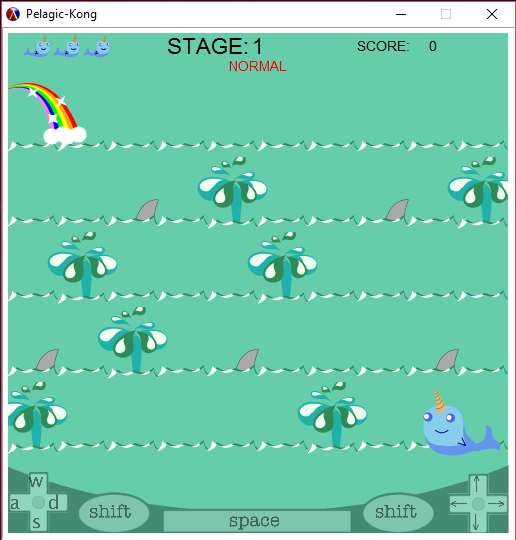

# Pelagic-Kong

## Jacob Phillips
### April 30, 2017

# Overview
This is a playable game loosely based off of the original Donkey Kong Game.

There are 30 total levels(3 difficulties 10 levels each.)

The user uses the arrow keys to avoid sharks and climb the spouts up to the rainbow to win.

The spouts are the ladders, the sharks are the barrels and getting to the rainbow is saving the princess.

  

**Authorship note:** All of the code described here was written by myself or my partner Kelly Stilson (@stilsonkl)

# Libraries Used
The code uses three libraries:

```
(require 2htdp/image)
(require 2htdp/universe)
(require lang/posn)
```

* The ```2htdp/image``` library provides the ability to draw all graphics used in the game.
* The ```2htdp/universe``` library is used to 
* The ```lang/posn``` library is used to 

## 1. Pad Handler

```
((pad=? pe "rshift") (make-world 'paused 0 player difficulty_level score stage))
((pad=? pe "shift")  (make-world 'paused 0 player difficulty_level score stage))
((and (pad=? pe "right")(not (player-climbing-spout s)))  (make-world 'playing time (move_walley s "right") difficulty_level score stage))
((and (pad=? pe "left") (not (player-climbing-spout s))) (make-world 'playing time (move_walley s "left")  difficulty_level score stage))
((pad=? pe "up")     (make-world 'playing time (move_walley s "up")    difficulty_level score stage))
((pad=? pe "d")      (make-world 'playing time (move_walley s "right") difficulty_level score stage))
((pad=? pe "a")      (make-world 'playing time (move_walley s "left")  difficulty_level score stage))
```
 
## 2. Move Walley Function

```
(define (move_walley s direction)
  (let ((posn-offset-x (cond ((eq? direction "right") STEP_SIZE_X)
                             ((eq? direction "left") (* -1 STEP_SIZE_X)) 
                             (else 0)))
        (posn-offset-y (cond ((eq? direction "down") STEP_SIZE_Y)
                             ((and (eq? direction "up") (touching-spout-tile? s)) (* -1 STEP_SIZE_Y))
                            (else 0))))
       (make-player (player-state (world-player s))
                    (posn-offset (player-position (world-player s)) (make-posn posn-offset-x posn-offset-y))
                    direction
                    (player-lives (world-player s)))))
```
## 3. Get Tile Function

```
(define (get-tile t pos s)
  (let* ((tiles (build-board (world-difficulty s)))
         (tilesTopY (tiles-top-y tiles s))
         (posY (posn-y pos))
         (rowY (round (- posY tilesTopY)))
         (colPerRow (/ (posn-x WINDOW) TILE_WIDTH))
         (col (quotient (posn-x pos) TILE_WIDTH))
         (row (round (/ rowY TILE_HEIGHT)))
         (tileCount (length tiles))
         (realIndex (+ (* row colPerRow) col)))
    (if (and (>= realIndex 0) (< realIndex tileCount))
        (list-ref tiles (inexact->exact (round realIndex)))
        '())))
```
Tiles Top Y:
```
(define (tiles-top-y t s)
  (let* ((tilesPerRow (/ (posn-x WINDOW) TILE_WIDTH))
        (rows (/ (length (build-board (world-difficulty s))) tilesPerRow))
        (gridHeight (* rows TILE_HEIGHT)))
    (- (- (posn-y WINDOW) (/ TILE_HEIGHT 2)) gridHeight)))
```

## 4. Touching Spout Tile? Function

```
(define (touching-spout-tile? s)
  (let* ((touchDistance (* .45 TILE_HEIGHT))
        (tiles (build-board (world-difficulty s)))
        (playerPos (player-position (world-player s)))
        (tileOn (get-tile tiles playerPos s)))
    (if (tile-up? tileOn)
        #t
        (let* ((tileAbovePos (make-posn (posn-x playerPos) (- (posn-y playerPos) touchDistance)))
              (tileAbove (get-tile tiles tileAbovePos s)))
          (if (not (or (null? tileAbove) (equal? tileAbove tileOn)))
              (tile-up? tileAbove) ;tileBelow cannot be in touching distance
              (let* ((tileBelowPos (make-posn (posn-x playerPos) (+ (posn-y playerPos) touchDistance)))
                    (tileBelow (get-tile tiles tileBelowPos s)))
                (tile-up? tileBelow)))))))
```
